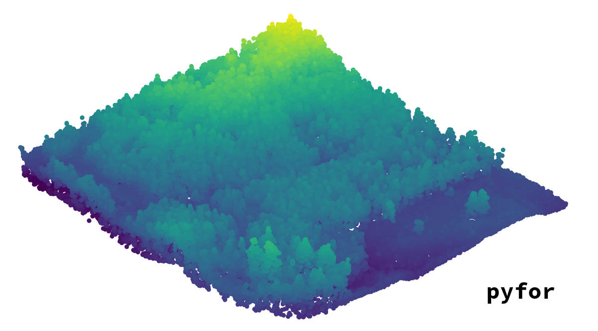

<p align="center">
  
</p>

[](http://brycefrank.com/pyfor)[](https://travis-ci.org/brycefrank/pyfor)[](https://coveralls.io/github/brycefrank/pyfor?branch=master)


**pyfor** is a Python package that assists in the processing of point cloud data in the context of forest inventory. It offers functions that convert raw point cloud data to usable information about forested landscapes using an object oriented (OOP) framework accessible for advanced and novice users of Python. pyfor aims to provide a cross platform means to interactively process point cloud data, as well as efficient ways to batch process large acquisitions.

**Cloud Computing**

pyfor is supported in part by the [AWS Cloud Credits for Research program](https://aws.amazon.com/research-credits/). I am exploring AWS for use in LiDAR data processing and development of this package. Please refer to the documents [here](http://brycefrank.com/cloud_computing_main).

## Release Status

Current Release: 0.3.0

Release Date: []

Release Status: 0.3.0 is an adolescent LiDAR data processing package adequate for single tile processing and large acqusitions. Routine processing functions are available, and many features are being added.

## Samples

- [Introduction](https://github.com/brycefrank/pyfor/blob/master/samples/Introduction.ipynb)
- [File Input and Plotting](https://github.com/brycefrank/pyfor/blob/master/samples/ImportsExports.ipynb)
- [Normalization](https://github.com/brycefrank/pyfor/blob/master/samples/Normalization.ipynb)
- [Canopy Height Models](https://github.com/brycefrank/pyfor/blob/master/samples/CanopyHeightModel.ipynb)
- [Clipping](https://github.com/brycefrank/pyfor/blob/master/samples/Clipping.ipynb)
- [Watershed Segmentation](https://github.com/brycefrank/pyfor/blob/master/samples/WatershedSegmentation.ipynb)
- [Grid Metrics](https://github.com/brycefrank/pyfor/blob/master/samples/GridMetrics.ipynb)
- [Collections](https://github.com/brycefrank/pyfor/blob/master/samples/Collections.ipynb)

## Installation

[miniconda](https://conda.io/miniconda.html) or Anaconda is required for your system before beginning. pyfor depends on many packages that are otherwise tricky and difficult to install (especially gdal and its bindings), and conda provides a quick and easy way to manage many different Python environments on your system simultaneously.

The following bash commands will install this branch of pyfor. It requires installation of miniconda (see above). This will install all of the prerequisites in that environment, named `pyfor_env`. pyfor depends on a lot of heavy libraries, so expect construction of the environment to take a little time.

```bash
git clone https://github.com/brycefrank/pyfor.git
cd pyfor
conda env create -f environment.yml

# For Linux / macOS:
source activate pyfor_env

# For Windows:
activate pyfor_env

pip install .
```

Following these commands, pyfor should load in the activated Python shell.

```python
import pyfor
```

If you see no errors, you are ready to process!

## Features

Below is a list of features, complete and otherwise.

- [X] Ground filter
- [X] Normalization
- [X] Rasterization
	- [X] Raster input and output
- [X] Interactive 2d & 3d plotting via Jupyter
	- [X] Point cloud plotting
	- [X] Raster plotting
- [X] Grid metrics extraction
- [X] Tree detection methods
    - [X] Watershed segmentation
    - [X] Layer stacking (Ayrey et al. 2017)
- [X] Canopy height model
	- [X] Median pit filter
	- [ ] Pit free algorithm (Chen et al. 2017)
- [X] Clipping point clouds
- [ ] Batch processing
	- [ ] Multiprocessor support
	- [ ] Cluster support
- [X] Voxelization methods

## Collaboration & Requests

If you would like to contribute, especially those experienced with `numba`, `numpy`, `gdal`, `ogr` and `pandas`, please contact me at bfrank70@gmail.com 

I am also willing to implement features on request. Feel free to [open an issue](https://github.com/brycefrank/pyfor/issues) with your request or email me at the address above.

pyfor will always remain a free service. Its development takes time, energy and a bit of money to maintain source code and host documentation. If you are so inclined, donations are accepted at the following:

[](https://www.paypal.com/cgi-bin/webscr?cmd=_donations&business=WBSUBMJFC4GFY&lc=US&item_name=pyfor%2ddevelopment&currency_code=USD&bn=PP%2dDonationsBF%3abtn_donateCC_LG%2egif%3aNonHosted)
