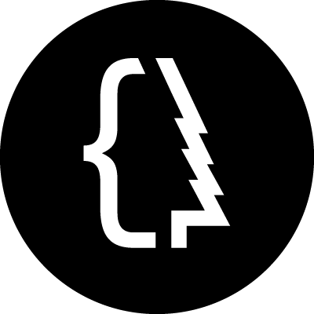

<p align="center">
  <br>
  <b>pyfor</b><br><br>
  <a href="https://brycefrank.com/pyfor">Documentation</a> |
  <a href="https://github.com/brycefrank/pyfor/blob/master/CHANGELOG.md">Changelog</a> |
  <a href="https://github.com/brycefrank/pyfor/issues/new">Request a Feature</a> |
  <a href="https://github.com/brycefrank/pyfor/projects/12">Road Map</a>
  <br>
  
</p>

**pyfor** is a Python package that assists in the processing of point cloud data in the context of forest inventory. 
This includes manipulation of point data, support for analysis, and a
memory optimized API for managing large collections of tiles.

## Release Status

Current Release: 0.4.0

Release Date: September 9th, 2026.

Release Status: 0.4.0 is a modernization release. pyfor runs on Python 3.10 and newer against
current versions of `laspy`, `numpy`, `pandas`, `scipy`, `geopandas`, and `rasterio`. It is
adequate for single tile processing and large acquisitions.

## What Does pyfor Do?

- [Normalization](https://brycefrank.com/pyfor/topics/normalization/)
- [Canopy Height Models](https://brycefrank.com/pyfor/topics/canopyheightmodel/)
- [Ground Filtering](https://brycefrank.com/pyfor/api/pyfor.ground_filter/)
- [Clipping](https://brycefrank.com/pyfor/topics/clipping/)
- [Large Acquisition Processing](https://brycefrank.com/pyfor/advanced/handlinglargeacquisitions/)

and many other tasks. See the [documentation](https://brycefrank.com/pyfor) for examples and applications.

What about tree segmentation? Please see pyfor's sister package [`treeseg`](https://github.com/brycefrank/treeseg) which
is a standalone package for tree segmentation and detection.

## Installation

pyfor requires Python 3.10 or newer. All dependencies ship as binary wheels, so `pip` in a virtual
environment is all that is needed:

```
python -m venv .venv
source .venv/bin/activate
pip install pyfor
```

`pyfor` was previously distributed through `conda-forge` and required GDAL and LASTools. Neither is
needed anymore: the .lax spatial index was replaced by chunked reads, and GIS input/output goes
through `rasterio`.

## Collaboration & Requests

If you would like to contribute, especially those experienced with `numpy`, `laspy`, point cloud
formats (`.las`, `.laz`, COPC) and `rasterio`, please contact me at bfrank70@gmail.com 

I am also willing to implement features on request. Feel free to [open an issue](https://github.com/brycefrank/pyfor/issues) with your request or email me at the address above.

pyfor will always remain a free service. Its development takes time, energy and a bit of money to maintain source code and host documentation. If you are so inclined, donations are accepted at the donation button at the top of the readme.

