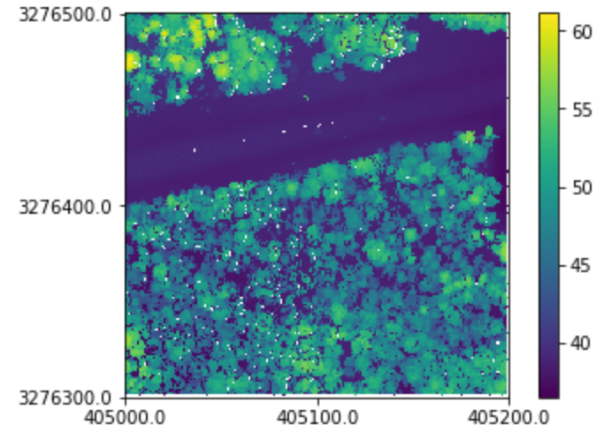

Getting Started
===============

This document describes a few basic operations, such as reading, writing, and basic point cloud
manipulations for a single points dataset.

Reading a Point Cloud
---------------------

Reading a point cloud means instantiating a `Cloud` object. The `Cloud` object is the integral
part of a point cloud analysis in pyfor. Instantiating a `Cloud` is simple:

.. code-block:: python

    import pyfor
    tile = pyfor.cloud.Cloud("../pyfortest/data/test.las")

Once we have an instance of our Cloud object we can explore some information regarding the
point cloud. We can print the Cloud object for a brief summary of the data within.

.. code-block:: python

    print(tile)

::

    File Path: ../data/test.las
    File Size: 6082545
    Number of Points: 217222
    Minimum (x y z): [405000.01, 3276300.01, 36.29]
    Maximum (x y z): [405199.99, 3276499.99, 61.12]
    Las Version: 1.3

An important attribute of all `Cloud` objects is `.data`. This represents the raw data and header
information of a `Cloud` object. It is managed by a separate, internal class called `LASData` in
the case of .las files and `PLYData` in the case of .ply files. These classes manage some
monotonous reading, writing and updating tasks for us, and are generally not necessary
to interact with directly. Still, it is important to know they exist.

Filtering Raw Points
--------------------

Sometimes it is interesting to view the raw points. For a `Cloud` object, these are stored in a
pandas dataframe in the `.data.points` attribute:

.. code-block:: python

    tile.data.points.head()

Direct modifications to the raw points should be done with caution, but is as simple as
over-writing this dataframe. For example, to remove all points with an x dimension exceeding
405120:

.. code-block:: python

    tile.data.points = tile.data.points[tile.data.points["x"] < 405120]

Plotting
--------

For quick visual inspection, a simple plotting method is available that uses `matplotlib` as a
backend:

.. code-block:: python

    tile.plot()

Writing Points
---------------

Finally, we can write our point cloud out to a new file:

.. code-block:: python

    tile.write('my_new_tile.las')

