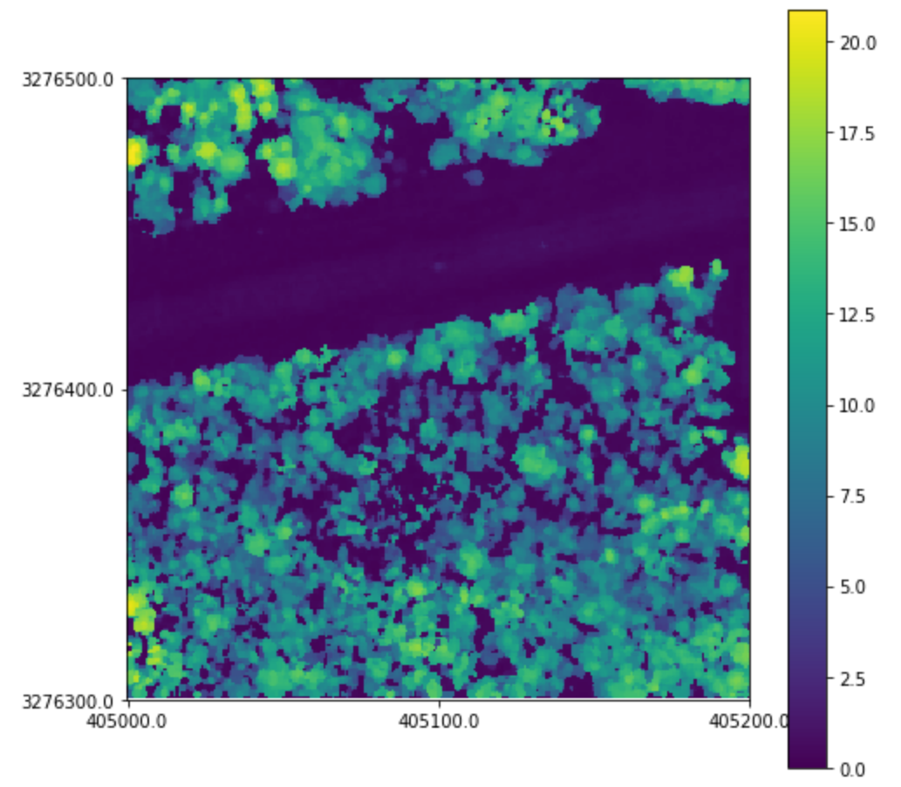

An integral part of any analysis is the production of a canopy height model, or CHM. The CHM is a
rasterized representation of the canopy of the forest. The creation and filtering of CHMs play a
large role in tree detection algorithms and are an interpretable way to display information.

A basic canopy height model can be created using a convenience wrapper:

```python
tile = pyfor.cloud.Cloud('my_tile.las')
tile.normalize(1)
chm = tile.chm(0.5)
```

The above block will load the las file, `my_tile.las`, remove the ground elevation (normalize) and
compute a basic canopy height model. Here, we specify a resolution of 0.5 units.

## Grid Alignment

A raster is computed on a grid, not on the extent of the data. The origin of that grid is snapped to
a multiple of the cell size, the target aligned pixels convention, the same one `gdal_translate
-tap`, terra, and lidR use. This is what lets a canopy height model of one tile line up with its
neighbour: both tiles put their cells on the same lattice, so the rasters can be mosaicked without
resampling, and comparing them cell by cell is meaningful.

```python
chm.grid.spec
```

```text
GridSpec(origin_x=405000.0, origin_y=3276300.0, cell_size=0.5, n=400, m=400)
```

When a raster has to be produced on a particular grid, for example to match an existing product or a
project wide grid, build the spec yourself and pass it to any of the gridding methods:

```python
spec = pyfor.rasterizer.GridSpec.covering(405000, 3276300, 405200, 3276500, 0.5)
chm = tile.chm(0.5, spec=spec)
```

The spec has to cover the cloud, and pyfor raises a `ValueError` if it does not rather than quietly
dropping points. See [GridSpec](/pyfor/api/pyfor.rasterizer/#pyfor.rasterizer.GridSpec) for the
details, and
[CloudDataFrame.grid_spec](/pyfor/api/pyfor.collection/#pyfor.collection.CloudDataFrame.grid_spec)
for building one that covers a whole collection.

The values pyfor computes for a cell do not depend on the grid it was handed: the maximum z of a
cell, and every other reduction, is the same whichever spec is used, and a spec only decides which
cells exist. Interpolation is the exception. When `interp_method` is given, cells that contain no
points are filled from a nearby cell, and a cell sitting exactly between two occupied cells can take
its value from either of them. Which one it takes is not specified, so `pit_filter` and
`interp_method` can produce a slightly different raster at those cells from one grid to the next.
Without interpolation, empty cells stay empty.

:::note
In pyfor no assumptions are made about the reference system, so always specify resolutions in the
units that the point cloud is registered in. In this case it was originally registered in meters,
therefore the output raster will have a resolution of 0.5 meters.
:::

## Manipulating Canopy Height Models

Often times, raw CHMs are not adequate for analysis. They contain many issues, such as missing
values and data pits. We can add some extra arguments to add NaN interpolation and pit filtering.

```python
better_chm = tile.chm(0.5, interp_method="nearest", pit_filter="median")
```

Here, we interpolate missing values using a nearest neighbor interpolator, and pass a median filter
over the canopy height model to smooth pits.

We can display our CHM with the `.plot` method:

```python
better_chm.plot()
```



## Writing Canopy Height Models

A canopy height model is a `Raster` object. And can be written out in the same way.

```python
better_chm.write('my_chm.tif')
```
