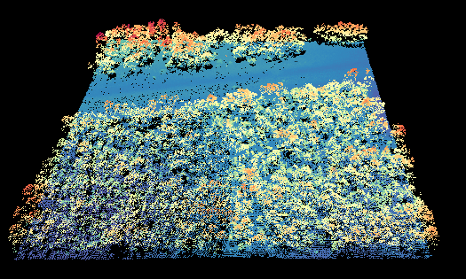
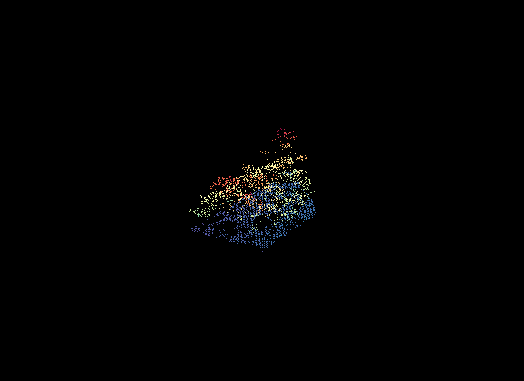

Often times we want to clip out LiDAR points using a shapefile. This can be done using pyfor's
`Cloud.clip` method. pyfor integrates with geopandas and shapely, convenient geospatial packages
for Python, to provide a way to clip point clouds.

```python
import pyfor
import geopandas

# Load point cloud
pc = pyfor.cloud.Cloud("pyfortest/data/test.las")
pc.plot3d()
```



As input to the clipping function we need any `shapely.geometry.Polygon` our heart desires, as long
as its coordinates correspond to the same physical space as the `Cloud` object. Here I extract a
`Polygon` from a shapefile using `geopandas`:

```python
# Load the polygon
polys = geopandas.read_file("pyfortest/data/clip.shp")
poly = polys["geometry"].iloc[0]
```

Finally, pass the `Polygon` to the clipping function. This function returns a new `Cloud` object.

```python
# Clip the point cloud
clipped = pc.clip(poly)
clipped.plot3d()
```


